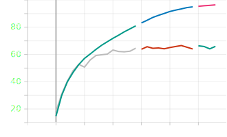
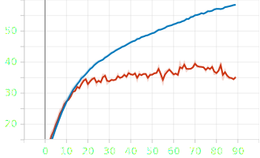

First run so far on the CIFAR-100 dataset with an 18-layer network.

    

This yielded a maximum accuracy of 61% on the validation dataset.
- The hyperparameters were:
    - batch_size = 64
    - learning rate = 0.00001
    - epoch = 16
    - weight_decay = none

The second run with a 32-layer network on the CIFAR-100 dataset.

    

This yielded a maximum accuracy of 67.8% on the valiation dataset.
- The hyperparameters were:
    - batch_size = 32 
    - learning rate = 0.00001
    - epoch = 16
    - weight_decay = none

These result are already better than what I could achieve with the AlexNet implementation.

    

The maximum accuracy on the same dataset for AlexNet was 40% on the validation dataset.
- The hyperparameters were:
    - batch_size = 128 
    - learning rate = 0.00001
    - epoch = 90 
    - weight_decay = none

