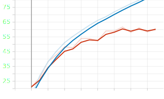

First run so far on the CIFAR-100 dataset.

    

This yielded a maximum accuracy of 61% on the validation dataset.
- The hyperparameters were:
    - batch_size = 64
    - learning rate = 0.00001
    - epoch = 16
    - weight_decay = none
